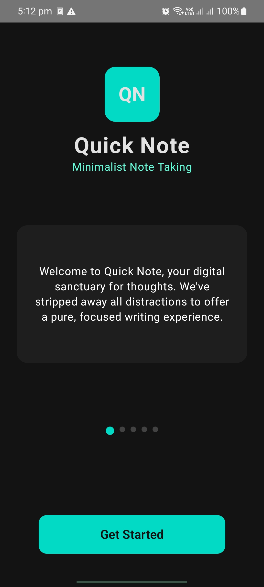
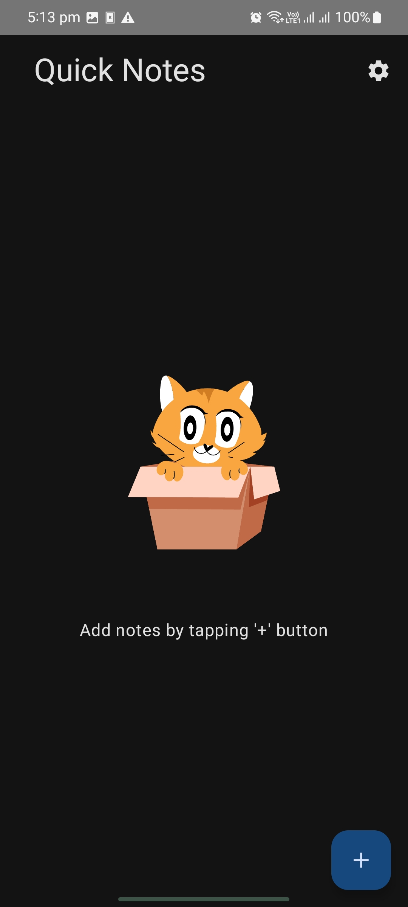
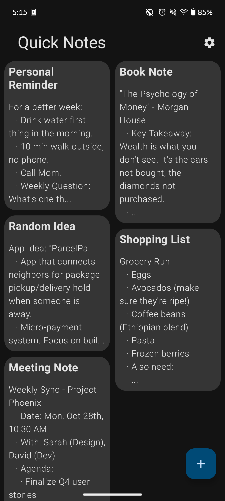
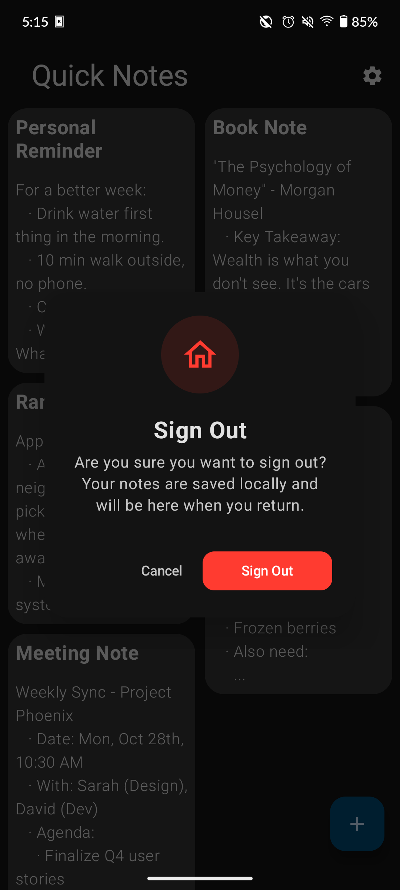

# 📝 Quick Notes

Quick Notes is a modern, intuitive note-taking application built for Android.

---

### ✨ Features

- 🔐 **Secure Authentication** — Google Sign-In via Firebase Auth
- 📝 **Note Management** — Create, edit, and organize your notes effortlessly
- 💾 **Offline Storage** — Room database for reliable local persistence
- 🎨 **Clean Interface** — Beautiful Jetpack Compose UI with Material Design
- ⚡ **Instant Updates** — Real-time note management

---

### 📱 Built With

- Kotlin + Jetpack Compose
- Firebase Authentication
- Room Database
- MVVM Architecture
- Coroutines for async operations

---
### 📸 Screenshots

#### Authentication Flow
| Login Screen                                         | Empty State |
|------------------------------------------------------|-------------|
|  |  |

#### Notes Management
| Create New Note | Notes Dashboard |
|-----------------|-----------------|
|  |  |

#### App Experience
| Settings & Sign Out |
|---------------------|
|  |

### 🚀 Getting Started

1. Clone the repository
2. Open in Android Studio
3. Build and run on emulator or device
4. Sign in with Google to start taking notes!

---

### 📌 Note

This app was developed as part of the MyApps Android Developer Intern assignment, showcasing modern Android development practices with Jetpack Compose and Firebase integration.

---

**Developed with ❤️ by Adnan Shah**

